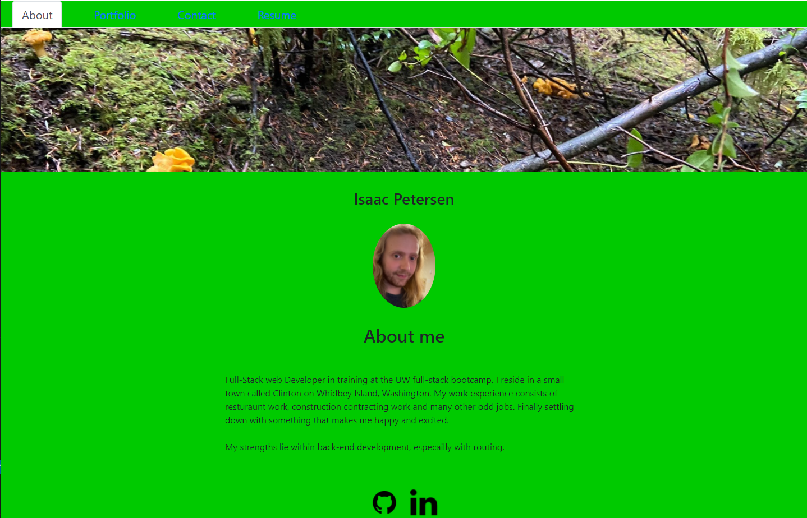

# React Portfolio 

## Description

This project utilized React to build a responsive portfolio page. There are four sections; about (a little about me), portfolio (some of my works), contact (responive form utilizing react-hook-form), and a resume page. 

This project helped me understand the basics of how to use react. 
## Table of Contents
- [Installation](#installation)
- [Available Scripts](#available-scripts)
- [License](#license)
- [Contributing](#contributing)
- [Questions](#questions)
- [Learn More](#learn-more)

## Installation

To install my portfolio, the user will need to create a clone of this repository by using the command `git clone` in git bash. The user will then have to open this repository in VSCode. The user will have to have node installed in their vscode.  

[For more information on installing npm](https://docs.npmjs.com/cli/v8/commands/npm-install)

Once cloned open the repo into the user's VSCODE suite and open the integrated terminal.

Once the terminal is open run the following command `npm i` to install the necessary dependancies.

## Available-Scripts

In the project directory, you can run:

### `npm start`

Runs the app in the development mode.\
Open [http://localhost:3000](http://localhost:3000) to view it in your browser.

The page will reload when you make changes.\
You may also see any lint errors in the console.

### `npm run build`

Builds the app for production to the `build` folder.\
It correctly bundles React in production mode and optimizes the build for the best performance.

The build is minified and the filenames include the hashes.\
Your app is ready to be deployed!

See the section about [deployment](https://facebook.github.io/create-react-app/docs/deployment) for more information.

### Provided here is a screenshot of the application running

## License

MIT License

Copyright &copy; 2022 Isaac Petersen

Permission is hereby granted, free of charge, to any person obtaining a copy
of this software and associated documentation files (the "Software"), to deal
in the Software without restriction, including without limitation the rights
to use, copy, modify, merge, publish, distribute, sublicense, and/or sell
copies of the Software, and to permit persons to whom the Software is
furnished to do so, subject to the following conditions:

The above copyright notice and this permission notice shall be included in all
copies or substantial portions of the Software.

THE SOFTWARE IS PROVIDED "AS IS", WITHOUT WARRANTY OF ANY KIND, EXPRESS OR
IMPLIED, INCLUDING BUT NOT LIMITED TO THE WARRANTIES OF MERCHANTABILITY,
FITNESS FOR A PARTICULAR PURPOSE AND NONINFRINGEMENT. IN NO EVENT SHALL THE
AUTHORS OR COPYRIGHT HOLDERS BE LIABLE FOR ANY CLAIM, DAMAGES OR OTHER
LIABILITY, WHETHER IN AN ACTION OF CONTRACT, TORT OR OTHERWISE, ARISING FROM,
OUT OF OR IN CONNECTION WITH THE SOFTWARE OR THE USE OR OTHER DEALINGS IN THE
SOFTWARE.

## Contributing

To contribute, please contact me via my email or through github.

## Questions

To contact me, use one of the links below:  
[Github profile](https://www.github.com/idpetersen)  
[Email Me](mailto:isaac.petersen5@gmail.com)

## Learn-More

You can learn more in the [Create React App documentation](https://facebook.github.io/create-react-app/docs/getting-started).

To learn React, check out the [React documentation](https://reactjs.org/).

I used [react-hook-form](https://react-hook-form.com/) to help create the responsive form.
